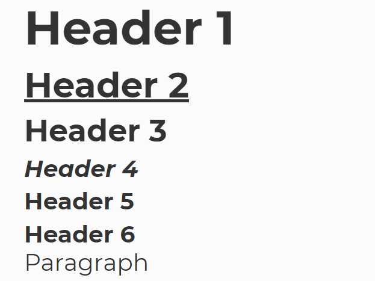

# Introduction

Hi there!

Welcome to this workshop on ‘Introduction to Digital Notetaking’. In this course, we will be covering the basics of notetaking and how to efficiently take digital notes using Markdown format.

(PS: This document was written with Markdown ❤)

[toc]

# Notetaking

## Definition

> Note-taking is the practice of recording information from different sources and platforms. By taking notes, the writer records the essence of the information, freeing their mind from having to recall everything.
>
> ~ [Wikipedia](https://en.wikipedia.org/wiki/Note-taking)

## Purpose

Notetaking allows us to capture information and help make sense of it. Our current world has so much information out there that it can be hard to store all that in our memory.

Notetaking helps eliminate the clutter and focus on what is important.

# Markdown

## Definition

> Markdown is a lightweight markup language for creating formatted text using a plain-text editor … a markup language that is appealing to human readers in its source code form. Markdown is widely used in blogging, instant messaging, online forums, collaborative software, documentation pages, and readme files.
>
> ~ [Wikipedia](https://en.wikipedia.org/wiki/Markdown)

## Purpose

- Markdown allows notetakers to collect and store notes in plain-text
- It allows to avoid [proprietary software](https://en.wikipedia.org/wiki/Proprietary_software), by taking notes in an [open-source](https://en.wikipedia.org/wiki/Open_source) format
- It allows to focus on the content, as
  - the content is separated from the styling settings
  - notetaker does not use buttons, but rather uses `#, ##, -` to denote different headers, sub-headers, lists, etc.

## Syntax

### Headers

```markdown
# Header 1
## Header 2
### Header 3
#### Header 4
##### Header 5
###### Header 6

Paragraph
```



### Emphasis

```markdown
*This text will be italic*
_This will also be italic_
**This text will be bold**
__This will also be bold__
*You **can** combine them*
```

*This text will be italic*

_This will also be italic_

**This text will be bold**

__This will also be bold__

*You **can** combine them*

### Lists

#### Unordered

```markdown
- Item 1
- Item 2
  - Item 2a
  - Item 2b

(or)

* Item 1
* Item 2
  * Item 2a
  * Item 2b
```

- Item 1
- Item 2
  - Item 2a
  - Item 2b

#### Ordered

```markdown
1. Item 1
2. Item 2
3. Item 3
	1. Item 3a
	2. Item 3b
```

1. Item 1
2. Item 2
3. Item 3
	1. Item 3a
	2. Item 3b

#### Tasks

```markdown
- [x] Completed item
- [ ] Incomplete item
```

- [x] Completed item
- [ ] Incomplete item

### Images

```markdown


Local Image


Web Image

```


### Links

```markdown
Unlabelled Links
http://github.com - automatic!

Labelled Links
[GitHub](http://github.com)
```

[GitHub](http://github.com)

### Code Fences

````markdown
```python
print("Hello World")
```
````

```python
print("Hello World")
```

### Tables

```markdown
|       | Column 1 | Column 2 |
| ----- | -------- | -------- |
| Row 1 |          |          |
| Row 2 |          |          |
```

|       | Column 1 | Column 2 |
| ----- | -------- | -------- |
| Row 1 |          |          |
| Row 2 |          |          |

## Diagrams

```markdown
flowchart LR
a --> b & c -.-> d
```

```mermaid
flowchart LR
a --> b & c -.-> d
```


## Math

```latex
This is inline $x^2$

$$
\int_0^\infty x^2
$$
```

This is inline $x^2$
$$
\int_0^\infty x^2
$$

# Usage

We will be using open-source editor [Marktext](https://github.com/marktext/marktext) for this workshop. You may download the latest version from [Marktext’s Github Releases](https://github.com/marktext/marktext/releases)