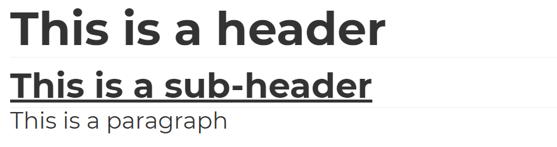

# Introduction

Hi there!

Welcome to this workshop on ‘Introduction to Digital Notetaking’. In this course, we will be covering the basics of notetaking and how to efficiently take digital notes using Markdown format.

This document was written with Markdown as well ❤

[toc]

# Notetaking

## Definition

> Note-taking is the practice of recording information from different sources and platforms. By taking notes, the writer records the essence of the information, freeing their mind from having to recall everything.
>
> ~ [Wikipedia](https://en.wikipedia.org/wiki/Note-taking)

## Purpose

Notetaking allows us to capture information and help make sense of it. Our current world has so much information out there that it can be hard to store all that in our memory.

Notetaking helps eliminate the clutter and focus on what is important.

# Markdown

## Definition

> Markdown is a lightweight markup language for creating formatted text using a plain-text editor … a markup language that is appealing to human readers in its source code form. Markdown is widely used in blogging, instant messaging, online forums, collaborative software, documentation pages, and readme files.
>
> ~ [Wikipedia](https://en.wikipedia.org/wiki/Markdown)

## Purpose

- Markdown allows notetakers to collect and store notes in plain-text
- It allows to avoid [proprietary software](https://en.wikipedia.org/wiki/Proprietary_software), by taking notes in an [open-source](https://en.wikipedia.org/wiki/Open_source) format
- It allows to focus on the content, as
  - the content is separated from the styling settings
  - notetaker does not use buttons, but rather uses `#, ##, -` to denote different headers, sub-headers, lists, etc.

## Example

```markdown
# This is a header

## This is a sub-header

This is a paragraph
```

The above markdown snippet gets [rendered](https://en.wikipedia.org/wiki/Rendering_(computer_graphics)) as



## Cheatsheet

You may use the following document as [Markdown Cheatsheet](02_markdown_cheatsheet.pdf)

# Usage

We will be using open-source editor [Marktext](https://github.com/marktext/marktext) for this workshop. You may download the latest version from [Marktext’s Github Releases](https://github.com/marktext/marktext/releases)